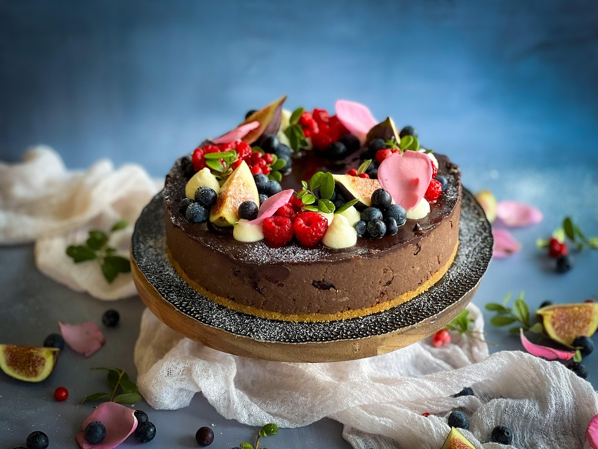

# Vidhan-Saxena
Restaurant-Website
[index.html](https://github.com/user-attachments/files/24978678/index.html)
<!DOCTYPE html>
<html lang="en">
<head>
  <meta charset="UTF-8" />
  <meta name="viewport" content="width=device-width, initial-scale=1.0" />
  <title>Foodie's Paradise 🍕</title>
  <link rel="stylesheet" href="style.css" />
  <link rel="stylesheet" href="https://cdnjs.cloudflare.com/ajax/libs/font-awesome/6.5.0/css/all.min.css">
</head>
<body>

  <!-- ===== HEADER ===== -->
  <header>
    <h1 class="logo">🍴 Foodie's Paradise</h1>
    <nav>
      <a href="#home">Home</a>
      <a href="#menu">Menu</a>
      <a href="#about">About</a>
      <a href="#contact">Contact</a>
    </nav>
  </header>

  <!-- ===== HERO SECTION WITH SLIDER ===== -->
  <section id="home" class="hero">
    

        <video autoplay muted loop playsinline>
          <source src="animation.mp4"  type="video/mp4">
        </video>
      

    

      <h2>Delicious Food Delivered Fast 🚀</h2>
      
Fresh • Tasty • Affordable

      <button onclick="orderNow()">Order Now</button>
    

  </section>

  <!-- ===== MENU SECTION ===== -->
  <section id="menu" class="menu">
    <h2>🍔 Our Popular Dishes</h2>
    

      

        
        <h3>Cheese Pizza</h3>
        
₹299

        <button onclick="addToCart('Cheese Pizza')"><i class="fa fa-cart-plus"></i> Add to Cart</button>
      

      

        
        <h3>Veg Burger</h3>
        
₹149

        <button onclick="addToCart('Veg Burger')"><i class="fa fa-cart-plus"></i> Add to Cart</button>
      

      

        
        <h3>White Sauce Pasta</h3>
        
₹199

        <button onclick="addToCart('Pasta')"><i class="fa fa-cart-plus"></i> Add to Cart</button>
      

      

        
        <h3>Maggie</h3>
        
₹60

        <button onclick="addToCart('Maggie')"><i class="fa fa-cart-plus"></i> Add to Cart</button>
      

      

        
        <h3>Cold Drink</h3>
        
₹100

        <button onclick="addToCart('Cold Drink')"><i class="fa fa-cart-plus"></i> Add to Cart</button>
      

        

        
        <h3>Lassi</h3>
        
₹250

        <button onclick="addToCart('Lassi')"><i class="fa fa-cart-plus"></i> Add to Cart</button>
      

      

        
        <h3>Chole Bhature</h3>
        
₹400

        <button onclick="addToCart('Chole Bhature')"><i class="fa fa-cart-plus"></i> Add to Cart</button>
      

      

        
        <h3>Cake</h3>
        
₹299

        <button onclick="addToCart('Cake')"><i class="fa fa-cart-plus"></i> Add to Cart</button>
      

    

  </section>

  <!-- ===== ABOUT SECTION ===== -->
  <section id="about" class="about">
    <h2>🌟 Why Choose Us?</h2>
    

      
<i class="fa fa-truck-fast"></i>
Fast Delivery

      
<i class="fa fa-leaf"></i>
Fresh Ingredients

      
<i class="fa fa-star"></i>
Top Quality

      
<i class="fa fa-heart"></i>
Made with Love

    

  </section>

  <!-- ===== CONTACT SECTION ===== -->
  <section id="contact" class="contact">
    <h2>📞 Contact Us</h2>
    <form id="contactForm">
      <input type="text" id="name" placeholder="Your Name">
      <input type="email" id="email" placeholder="Your Email">
      <textarea id="message" placeholder="Your Message"></textarea>
      <button type="submit">Send Message</button>
    </form>

    

      
<i class="fa fa-phone"></i> +91 70171 64192

      
<i class="fa fa-envelope"></i> vidhansaxena9@mail.com

      
<i class="fa fa-location-dot"></i> Pilibhit, India

    

  </section>

  <!-- ===== FOOTER ===== -->
  <footer>
    
© 2026 Foodie's Paradise | Follow Us

    

      <i class="fab fa-facebook"></i>
      <i class="fab fa-instagram"></i>
      <i class="fab fa-twitter"></i>
    

  </footer>

  
</body>
</html>

[style.css](https://github.com/user-attachments/files/24978680/style.css)

{
  margin: 0;
  padding: 0;
  box-sizing: border-box;
  font-family: 'Segoe UI', sans-serif;
  scroll-behavior: smooth;
}

body {
  background: linear-gradient(135deg, #ffecd2, #fcb69f);
}

/* Header */
header {
  display: flex;
  justify-content: space-between;
  align-items: center;
  padding: 15px 40px;
  background: linear-gradient(90deg, #ff512f, #dd2476);
  color: white;
  position: sticky;
  top: 0;
  z-index: 1000;
}

nav a {
  color: white;
  margin: 0 15px;
  text-decoration: none;
  font-weight: bold;
  transition: 0.3s;
}

nav a:hover {
  color: yellow;
}

/* Hero */
.hero {
  position: relative;
  text-align: center;
  color: white;
}

.slider {
  position: relative;
  height: 70vh;
  overflow: hidden;
}

.slide {
  width: 100%;
  height: 70vh;
  object-fit: cover;
  position: absolute;
  opacity: 0;
  transition: opacity 1s ease-in-out;
}

.slide.active {
  opacity: 1;
}

.hero-text {
  position: absolute;
  top: 50%;
  left: 50%;
  transform: translate(-50%, -50%);
  background: rgba(0,0,0,0.5);
  padding: 30px;
  border-radius: 10px;
}

.hero button {
  margin-top: 15px;
  padding: 10px 20px;
  border: none;
  background: #00c9ff;
  color: white;
  font-size: 18px;
  border-radius: 5px;
  cursor: pointer;
  transition: 0.3s;
}

.hero button:hover {
  background: #92fe9d;
  color: black;
}

/* Menu */
.menu {
  padding: 60px 20px;
  text-align: center;
}

.menu-grid {
  display: grid;
  grid-template-columns: repeat(auto-fit, minmax(250px, 1fr));
  gap: 20px;
  margin-top: 30px;
}

.item {
  background: white;
  padding: 15px;
  border-radius: 10px;
  box-shadow: 0 5px 15px rgba(0,0,0,0.2);
  transition: transform 0.3s;
}

.item:hover {
  transform: scale(1.05);
}

.item img {
  width: 100%;
  border-radius: 10px;
}

.item button {
  margin-top: 10px;
  padding: 8px 15px;
  border: none;
  background: #ff512f;
  color: white;
  cursor: pointer;
  border-radius: 5px;
}

/* About */
.about {
  padding: 60px 20px;
  text-align: center;
  background: linear-gradient(135deg, #43cea2, #185a9d);
  color: white;
}

.features {
  display: flex;
  justify-content: center;
  gap: 40px;
  margin-top: 30px;
  flex-wrap: wrap;
}

.features div {
  font-size: 20px;
}

/* Contact */
.contact {
  padding: 60px 20px;
  text-align: center;
}

form {
  max-width: 400px;
  margin: auto;
  display: flex;
  flex-direction: column;
}

form input, form textarea {
  margin: 10px 0;
  padding: 10px;
  border-radius: 5px;
  border: 1px solid #ccc;
}

form button {
  background: #dd2476;
  color: white;
  padding: 10px;
  border: none;
  border-radius: 5px;
  cursor: pointer;
}

/* Footer */
footer {
  background: #222;
  color: white;
  text-align: center;
  padding: 20px;
}

.socials i {
  margin: 10px;
  cursor: pointer;
  transition: 0.3s;
}

.socials i:hover {
  color: #00c9ff;
}

/* Responsive */
@media(max-width: 768px) {
  header {
    flex-direction: column;
  }
}

[script.js](https://github.com/user-attachments/files/24978692/script.js)
// HERO IMAGE SLIDER
let slides = document.querySelectorAll(".slide");
let index = 0;

function showSlide() {
  slides.forEach(slide => slide.classList.remove("active"));
  index = (index + 1) % slides.length;
  slides[index].classList.add("active");
}
setInterval(showSlide, 3000);

// ORDER BUTTON
function orderNow() {
  alert("🎉 Redirecting to menu!");
  document.querySelector("#menu").scrollIntoView({ behavior: "smooth" });
}

// ADD TO CART
function addToCart(item) {
  alert(item + " added to cart 🛒");
}

// FORM VALIDATION
document.getElementById("contactForm").addEventListener("submit", function(e) {
  e.preventDefault();
  let name = document.getElementById("name").value.trim();
  let email = document.getElementById("email").value.trim();
  let message = document.getElementById("message").value.trim();

  if (name === "" || email === "" || message === "") {
    alert("⚠️ Please fill all fields!");
  } else {
    alert("✅ Message sent successfully!");
    this.reset();
  }
});
